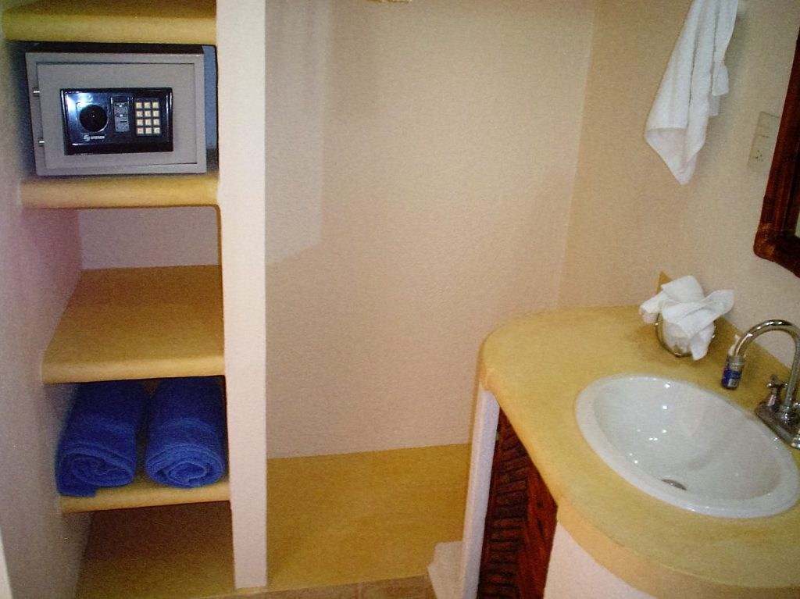
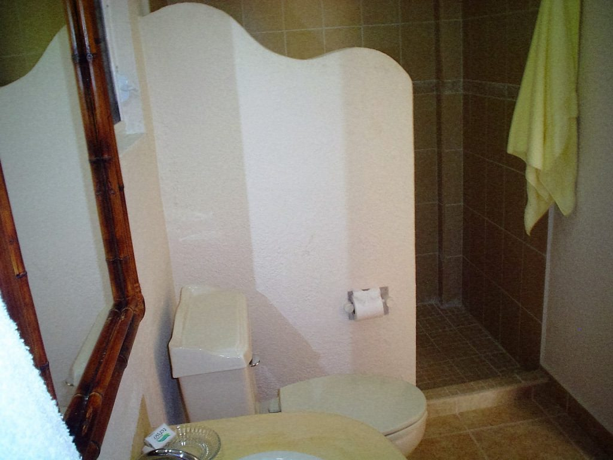
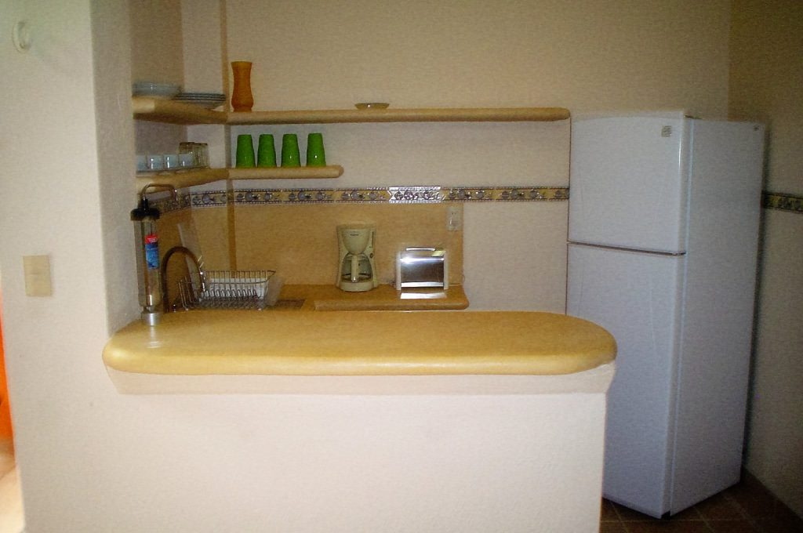
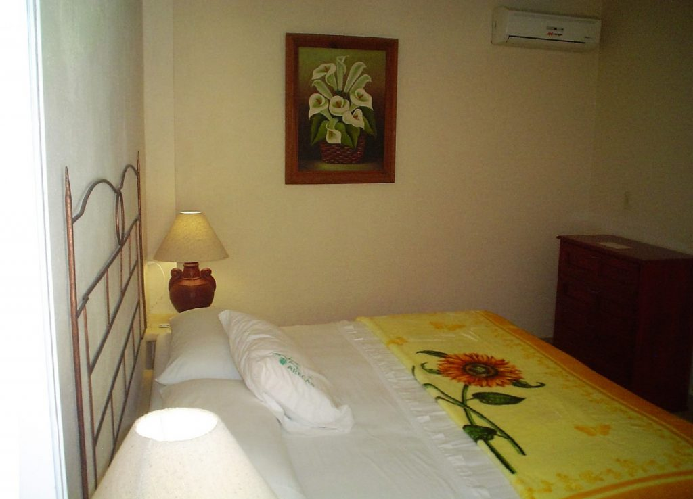
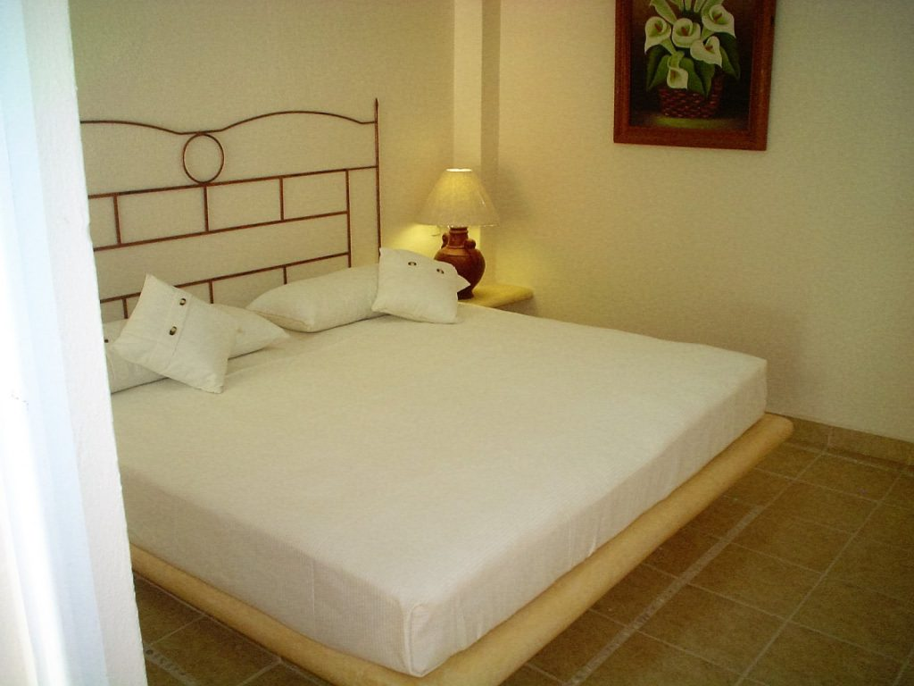
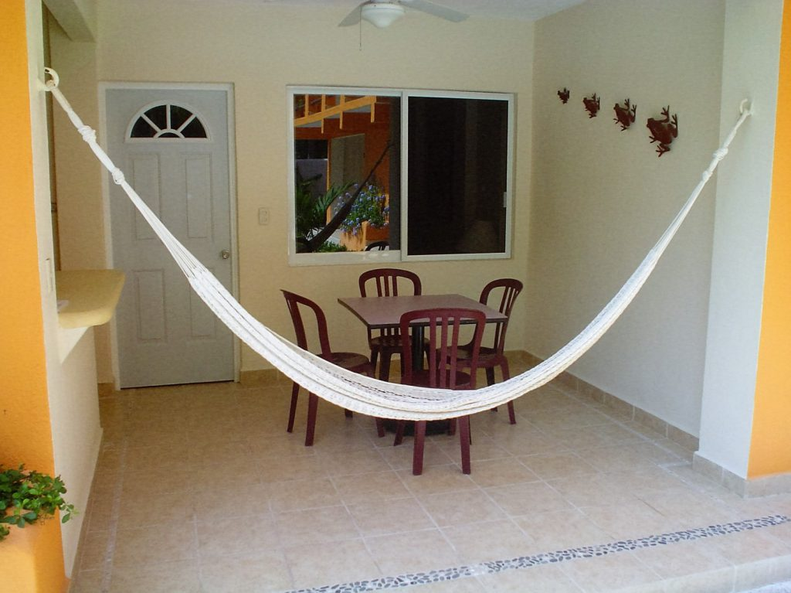
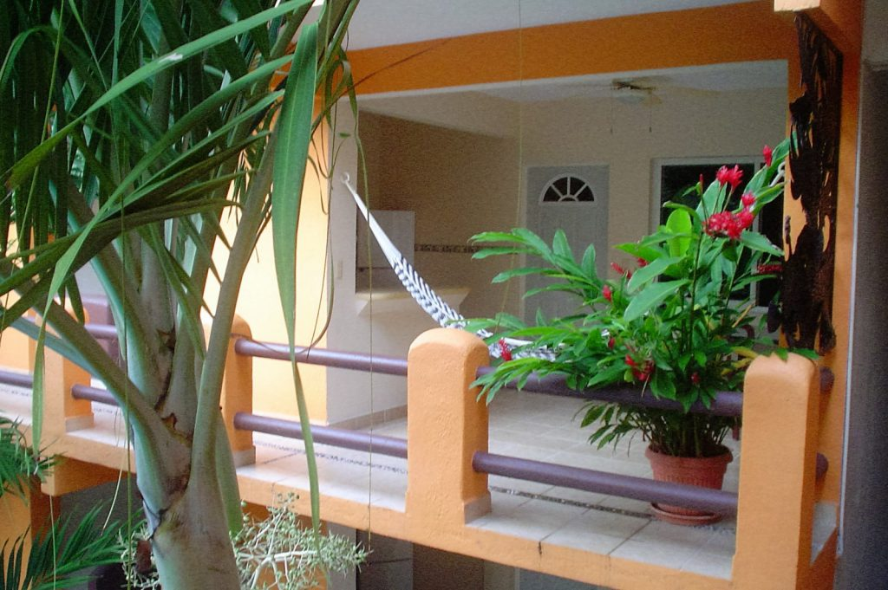

import { t } from "i18next";
import Amenidades from '../../../components/Amenidades.astro'
import Galeria from "../../../components/Galeria.astro";

<Amenidades variable={t("hoteles.amenidades")} whatsapp={frontmatter.whatsapp} estrellas={frontmatter.estrellas} matriz={[ "Climatisation", "Ventilateur de plafond", "Coffre-fort", "Piscine", "Kitchenette", "Jacuzzi", "Internet", "Grill au charbon", "micro-ondes" ]} > 

## A quelques minutes de Playa La Ropa à Zihuatanejo

L'hôtel; Il est **situé dans la zone dorée de la célèbre plage Playa la Ropa, à 3 minutes à pied**. Il dispose de 8 suites, dont 4 à l'étage supérieur, toutes avec vue sur la piscine.

Chaque Suite a été conçue pour 2 personnes, en pensant au repos et au confort des couples, une 3ème est possible. Personne dans le même lit. La chambre avec 1 lit King Size, salle de bain complète, climatisation, ventilateur de plafond, placard et coffre-fort.

Terrasse avec ventilateur de plafond, une table avec 3 chaises et un hamac, Kitchenette (Pas de cuisinière) avec **eau purifiée pour boire, réfrigérateur, four micro-ondes, cafetière, grille-pain, évier, vaisselle et couverts**. Piscine 7,00m x 8,50m x 1,50m de profondeur Grill disponible. (Charbon; gratuit) Internet Wi Fi. (gratuit)

Pour réserver, un dépôt bancaire d'1 nuit est demandé (Non remboursable), le solde sera réglé en espèces.

Arrivée à 14h00 Départ à 12h00
Désolé, nous n'acceptons pas les cartes de crédit, les cartes de débit, les chèques de voyage ou les chèques personnels. Les animaux ne sont pas acceptés. Nous ne disposons pas d'installations pour les personnes handicapées. Les installations sont exclusivement réservées aux clients, les visiteurs ne sont donc pas autorisés. Des questions ou des préoccupations, nous sommes à votre service.

</Amenidades>

<Galeria>
-  
-  
-  
-  
-  
-  
-  
-  

</Galeria>